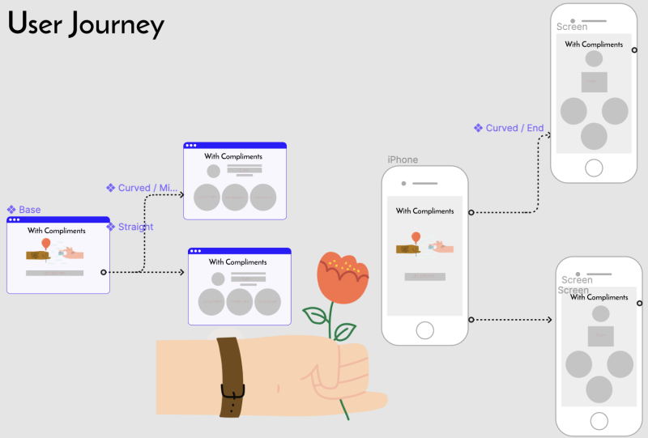
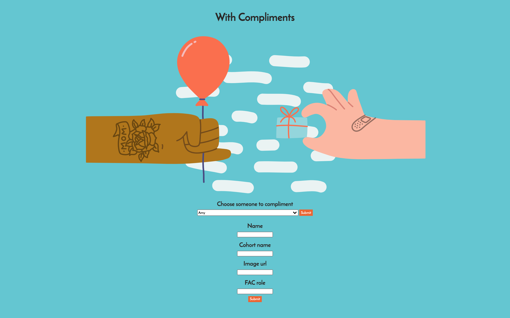

# week5-database-acsm

---

We deployed our application on [Heroku](https://with-compliments.herokuapp.com/)

---

**Roles**

Deployment: Antonio 
Facilitator: Chun 
User: Maryam 
Quality: Safia 

---

**Concept**

Possibilities:

Recipes Blog 
Compliments Blog 

---

**Schema**

Below is the schema for our database.

`fac_members` table
| Column      | Type | Constraints |
| ----------- | ----------- |----------- |
|  id         | serial       |primary key,       |
|  full_name  | varchar(255) |NOT NULL        |
| img_url | text |
| cohort_name | varchar(255)  |Title       |
| fac_role    | Texvarchar(255)t        |Text        |

`users` table
| Column      | Type | Constraints |
| ----------- | ----------- |----------- |
| id      | serial       |primary key       |
| username   | varcahr(255)    |not null        |

`compliments` table
| Column      | Type | Constraints |
| ----------- | ----------- |----------- |
| id      | serial       |primary key       |
| user_id   | integer     |References users(id) |
| fac_member_id   | integer        |References fac_members(id)        |
| text_content   | Text        |Text        |
| created_at   | timestamp        |Text        |

---

**Mockup of main page**

---

**Final main page**

---

## **💾 How to install the project**

1. `git clone`
2. cd into the directory on your computer
3. run `npm i` to install node modules
4. Run `npm start` to run the website on a nodemon local server on port 3000 ([http://localhost:3000](http://localhost:8000/))
5. You can do `npm test` to run tests on handler.js

---

We ran out of time! :( These are things we wished we could have completed:
 - styling on fac members page
 - switching groups more often
 - doing more cypress tests
 - having a link on fac member page going back to main page
